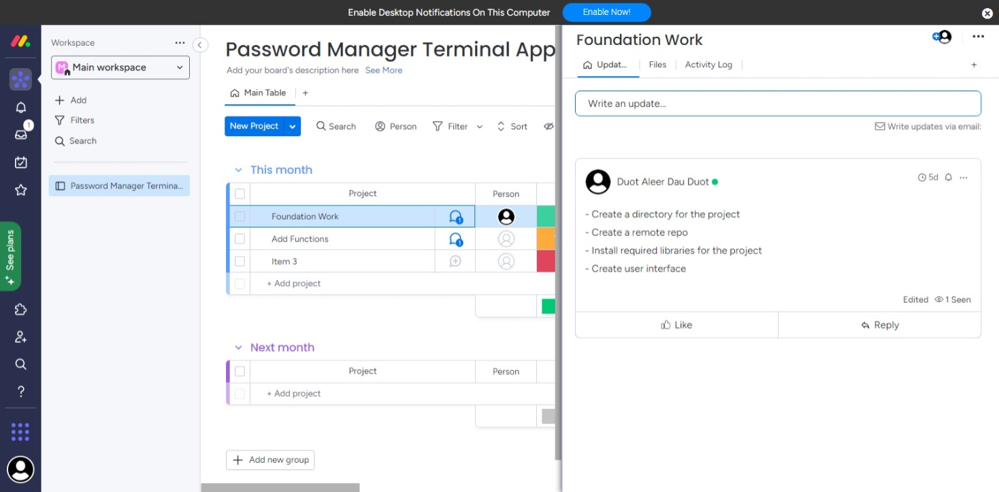
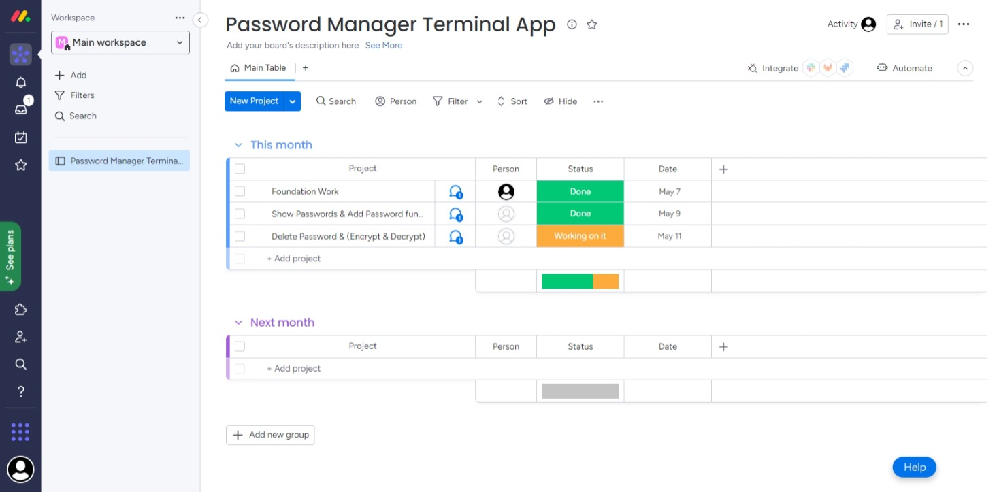
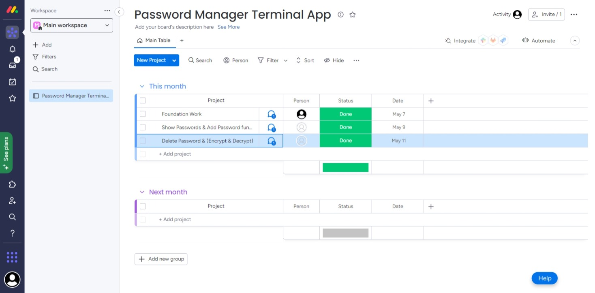

[Link To Git repository](https://github.com/Duotduot/password-manager)

PEP 8 is the style guide used in this application. Some of the PEP 8 styling conventions used include:  
- Using 4 spaces for indentation  
- Using comments in the code. Also writing them on a separate line  
- Descriptive variable names  
- Consistent naming convention for functions, classes and modules.  

## FEATURES  
1. **Add password**- This feature allows the user to add a new password to the password manager. The user will be prompted to enter a site name and password, and the password will be encrypted and stored in the password manager's dictionary. The application will also write the updated password data to a JSON file on disk. This feature demonstrates the use of variables and variable scope to store and modify password data, as well as the use of error handling to catch file write errors.  
2. **Show password**- This feature allows the user to retrieve a saved password from the password manager. The user will be prompted to enter a site name, and the application will check if the site name is present in the password manager's dictionary. If the site name is found, the corresponding encrypted password will be retrieved, decrypted, and printed to the console. If the site name is not found, the application will notify the user. This feature demonstrates the use of conditional control structures to check for the presence of site names in the password manager's dictionary.   
3. **Delete password**- This feature allows the user to delete a saved password from the password manager. The user will be prompted to enter a site name, and the application will check if the site name is present in the password manager's dictionary. If the site name is found, the corresponding password will be deleted from the dictionary and the updated password data will be written to the JSON file. If the site name is not found, the application will notify the user. This feature demonstrates the use of loops and conditional control structures to search for and delete password data from the password manager's dictionary, as well as the use of error handling to catch file write errors.  

## Implementation Plan  
1. **Add Password(checklist) 1-2days**  
- Parse command line argument to get site name  
- Check if site name already exists 
- If site exists, prompt user to update password  
- If site name doesn't exist, prompt user to enter new password  
- Encrypt password and save it to file  
2. **Retrieve saved password(3rd day)**  
- Parse command line argument to get site name  
- Check if site exists in password store  
- If site exists, decrypt password and display it  
- If site does not exist, display an error message  
- Implement error handling for file access and decryption errors  
3. **Delete password(last day)**  
- Parse command line argument to get site name  
- Check if site exists in password store  
- If site exists, prompt user to delete password  
- Remove site and password from password store  
- Implement error handling for file access errors  
Used a project management platform called Monday. Screenshots of the project plan are attached below.  

  

## Help  
**Installation**  
- Have Python3 installed on your system  
- Download the source code for the Password Manager  
- Run the app by executing the following command in the command line; *'python3 password_manager.py'*  
**Dependencies**  
Cryptography - used for encrypting and decrypting passwords  
**System/Hardware Requirements**  
The app runs on any system that has Python 3 installed. There are no specific hardware requirements.  
**Usage**  
- **Show Passwords** - This option shows/retrieves saved passwords from the password manager.  
- **Add Password** - This option adds a new password to the password manager.  
- **Delete Password** - This option deletes the password from the password manager.  
- **Exit** - This option exits the application.